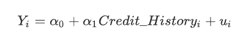
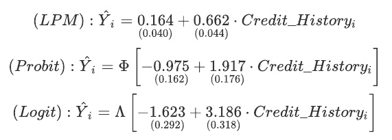
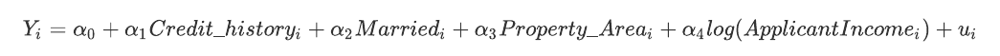
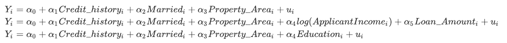
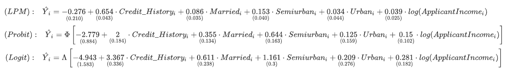

<div align = center><h3>
    Loan Defaults
    </h3></div>
<div align = center><h4> Analytics Vidhya Contest Dataset </h4></div>

Our main goal is to identify the factors that affect loan defaults and propose a model that would help estimate the probability of failing to repay on time. To keep the main body of the report at most 3 pages long, graphs and other materials were left in the Appendix – we will often be referring to them.

#### Exploratory analysis

By inspecting the dataset, we see that there are some NA values as well as whitespaces and empty cells. To consistently represent the missing values, we recoded all the problematic values into NAs. We will keep all the missing values in the dataset for now because they might be informative later. Furthermore, removing all the missing values would leave us with substantially fewer observations, and thus, by omitting the NAs only in the "useful" variables, we may end up with a larger sample – more on that later.

In Figure 1 in the Appendix, we may see that `Credit_History` has the highest proportion of NAs (around 8%) but the variable of interest, `Loan_Status_Int`, seems to be complete.

If we are still concerned whether our variables contain nonsensical values, let us run through all the columns using the `unique` function (instead of creating cross-tables) to find potentially unwanted values. Numerical vectors have too many unique values, thus, we used the class function to assess whether these variables were entirely made up of numbers (they wouldn't be classified as numeric if they would contain at least one character value). From the output (R code line 66-78), we can conclude that the dataset in its current form seems to be ready for further analysis.

Knowing that our dataset no longer contains nonsensical values, we may render the comprehensive summary table from the `summarytools ` package (Appendix – Figure 11) to see the variable name, its type, values, frequencies, simple graph and the number of missing values.

#### Variables

Figure 2 and Figure 3 in the Appendix illustrate the distributions of both the categorical and the numerical variables (these were binned into 10 levels by deciles where 1 represents the lowest values). 

Together with the summary (Appendix – Figure 11), we may immediately spot some variables that may be unfit for our analysis, for example, in `Loan_Amount_Term` more than 85% of applicants took a 360-month loan leaving around 92 of the applications to be scattered among 9 other values.

Furthermore, we see that `ApplicantIncome` and `CoapplicantIncome` are heavily skewed and will need to be log-transformed, if we wanted to use them. However, unlike the first one, the second variable contains a lot of 0s, which makes it unfit for said transformation. Last but not least, we see that females are underrepresented in our dataset.

To get a better idea which variables should be seriously considered for the model, we will be measuring their "performance" using the area under the ROC curve (AUC), which goes a step further than confusion matrices. The idea is that we plot the true positive rate against the false positive rate at various thresholds and measure the area under such curve. If the area is very close to 0.5 then these variables have very low diagnostic capabilities and should, therefore, be ignored. This approach is heavily inspired by the exercises in the Data Science with R course at IES.

The results can be found in the Appendix (Figure 4). Note that numeric variables were binned and the seed was fixed to get the same numbers across multiple runs. The testing AUCs may be a bit inaccurate due to the relatively small number of observations (around 20% of the whole dataset), thus, training AUCs should be taken more seriously. 

By observing the results in Figure 4, we believe that we should eliminate `Dependents`, `Gender` and `Self_Employed` due to their poor performance. We are left with (though still quite poor performance-wise) ` Married`,  `Education`, `Credit_History`, `Property_Area`, `Applicant_Income` and `Loan_Amount`. 

#### Base model

The variable `Credit_History` had by far, the best performance in terms of AUC, and thus, let us use it in the baseline model. The following equation will be estimated using the linear probability, probit and logit models, where *Y_i=P(Loan_Status_Int_i = 1|x)* is the response probability and *u​* is the error term:





We believe that the coefficient `alpha_1` should be positive in all three models – clients with a good credit history should be more likely to repay on time.

The estimation results of the three models are the following – standard errors are below the estimates (robust SEs for LPM due to built-in heteroskedasticity):





We see that the parameter of `Credit_History` is significant and positive in all three models. The result from the LPM model suggests that knowing client's credit history increases the chance of paying on time by whopping 66%. Some of the model's fitted values, however, are above 1, which is a general issue of the linear probability approach.

Moreover, by obtaining the average partial effect for the probit and the logit model, we see that, in both cases, the average change in probability whenever `Credit_History = 1` is also around 66%.

Let us comment on the goodness-of-fit measures later as we have no other model to compare the measures with (besides a constant model). It is worth noting that the probit and the logit models can only be compared with corresponding probit and logit models, respectively.

#### Full model

Through trial and error, we've identified a combination of variables which yielded the lowest Akaike Information Criterion (AIC) in both the logit and the probit models: 



The runner-ups, however, were not much worse. The difference between the "best-of-the-best" and the "worst-of-the-best" AICs was no more than *|2|​* suggesting that other combinations would also work relatively well. Here are some of the models we've also considered:



Although the first model may not be the best in terms of pseudo R^2^ or residual deviance (though very close to others), we have decided to base our rankings mainly on AIC because it penalizes for overfitting. Moreover, as discussed in part 1, we've maximized the number of observations to 541 by only selecting the aforementioned variables and filtering them out accordingly. In a smaller dataset with all NAs filtered out, we were able to achieve "better" AIC. But in reality, we shouldn't compare these two results due to the different number of observations. Therefore, we believe that by maximizing the number of observations, we are able to tell a more truthful story.

The estimation of our preferred model can be seen below (note that `Property_Area​` is a factor with levels ​`Rural`, `Semiurban` and `Urban`​):





The results (see Figure 10 for a nicer output) are pretty intuitive: although the past performance is not an indicator of future returns, we would, again, expect borrowers with better credit history to be better at repayments (high significance in all three models). If this were not the case, all the expensive credit databases would be useless. When it comes to the `Property_Area` coefficients, these are also quite expected. The suburban areas are inhabited by wealthier people, who do not have just higher level of income, but also higher social capital. They are more likely to have friends or family members who can somehow help them when they are in need. The urban areas are often inhabited by some of the richest people (San Francisco), but also by some of the poorest ones (Detroit), so we are unsurprised by the insignificance.

The positive sign of the marital status parameter is also unsurprising. When the household has two members in productive age, it is more resilient to loan defaults. The probability that one person loses their job is surely higher than the probability of two people losing job at the same time (and the same location). 

The average partial effects in the probit and logit models are roughly the same as the coefficients of the LPM model (see Figure 5 & 6). Comparing these with the base model, we see that the effect of `Credit_History` is only slightly less pronounced in the larger models. Moreover, the average change in probability of being married and living in a semiurban area is around 8.5% and 15%, respectively.

It is important to note that, again, some of the fitted values of the LPM model are above one, which renders the technique, at the very least, mildly problematic.

#### Discussion

The base model suffered from endogeneity as some of the added variables were statistically significant. Furthermore, the null hypothesis in both the Wald test and the Likelihood-ratio test is rejected in all cases, which leads us to believe that the added variables are significant and the unrestricted model has better fit.

To check the predictive power of the probit and logit models, we plotted their ROCs (Appendix – Figure 7 & 8) and calculated their AUCs, which was 0.802 for both approaches. This suggests a satisfactory level of discrimination. 

Based on the confusion matrix (Appendix – Figure 9), we can determine accuracy of 82.8%, sensitivity of 96.4%, and specificity of 47.3% in all three models. These figures are robust to the choice of regression technique when the cutoff value is 0.5. Thus, if the financial institution was using our model, it would extend the loan to almost all creditworthy applicants, but also to quite a lot applicants who would fail. 

Translating into financial metrics, about 17.33% of the company's portfolio would be non-performing loans. For most of mortgage providers, this would be apocalyptic. The use of an optimal cutoff value makes the situation only a bit better by lowering the NPL ratio to 17.29%. Sadly, this is done by being even less conservative, not more.

We do not know who are the target customers of our company. It seems that about 27.7% of applicants fail to repay. This is not extraordinary, and therefore, a higher level of conservatism is probably needed. But even if we use a cutoff value of 0.9 in our model, we have high failure ratios. And above that, we are losing hundreds of profit opportunities.

After trying a few other specifications, we concluded that focusing on the credit history, marital status, area, and applicant income would be the best option.

<div style = "page-break-after: always;"></div>


#### Appendix


<div align = center>Figure 1 - Proportion of missing values per variable</div>


<div align = center>Figure 2 - Barplots for categorical variables in the context of the dependent variable</div>


<div align = center>Figure 3 - Barplots for binned numerical variables in the context of the dependent variable</div>


<div align = center>Figure 4 - Variable performance test by AUC</div>

```
Gender_pred training AUC: 0.5293			Credit_History_pred training AUC: 0.6876
Gender_pred testing AUC: 0.5217				Credit_History_pred testing AUC: 0.8044
Married_pred training AUC: 0.5458			Property_Area_pred training AUC: 0.592
Married_pred testing AUC: 0.6019			Property_Area_pred testing AUC: 0.5796
Dependents_pred training AUC: 0.5211		ApplicantIncome_pred training AUC: 0.5823
Dependents_pred testing AUC: 0.5663			ApplicantIncome_pred testing AUC: 0.6585
Education_pred training AUC: 0.5312    		CoapplicantIncome_pred training AUC: 0.537
Education_pred testing AUC: 0.6495			CoapplicantIncome_pred testing AUC: 0.6085
Self_Employed_pred training AUC: 0.5144		LoanAmount_pred training AUC: 0.5432
Self_Employed_pred testing AUC: 0.5747		LoanAmount_pred testing AUC: 0.6682
Loan_Amount_Term_pred training AUC: 0.5442
Loan_Amount_Term_pred testing AUC: 0.6395
```


<div align = center>Figure 5 - APE of the probit coefficients</div>

```
ApplicantIncome		Credit_History1		Married		Semiurban	   Urban
1.126e-05          	0.6544				0.08836		0.1529	  	   0.03475
```


<div align = center>Figure 6 - APE of the logit coefficients</div>

```
ApplicantIncome		Credit_History1		Married		Semiurban	   Urban
1.202e-05			0.6525				0.08557		0.152		   0.03338
```


<div align = center>Figure 7 - ROC of the logit model</div>


<div align = center>Figure 8 - ROC of the probit model</div>


<div align = center>Figure 9 - Confusion Matrix</div>


<div align = center>Figure 10 - Estimation results</div>


<div align = center>Figure 11 - Loan dataset summary</div>

<div class="container st-container">
  <table class="table table-striped table-bordered st-table st-table-striped st-table-bordered st-multiline ">
  <thead>
    <tr>
      <th align="center" class="st-protect-top-border"><strong>No</strong></th>
      <th align="center" class="st-protect-top-border"><strong>Variable</strong></th>
      <th align="center" class="st-protect-top-border"><strong>Stats / Values</strong></th>
      <th align="center" class="st-protect-top-border"><strong>Freqs (% of Valid)</strong></th>
      <th align="center" class="st-protect-top-border"><strong></strong></th>
        <th align="center" class="st-protect-top-border"><strong>Missing</strong></th>
    </tr>
  </thead>
  <tbody>
    <tr>
      <td align="center">1</td>
      <td align="left">Gender
[factor]</td>
      <td align="left">1. Female
2. Male</td>
      <td align="left" style="padding:0;vertical-align:middle"><table style="border-collapse:collapse;border:none;margin:0"><tr style="background-color:transparent"><td style="padding:0 5px 0 7px;margin:0;border:0" align="right">112</td><td style="padding:0 2px 0 0;border:0;" align="left">(</td><td style="padding:0;border:0" align="right">18.6%</td><td style="padding:0 4px 0 2px;border:0" align="left">)</td></tr><tr style="background-color:transparent"><td style="padding:0 5px 0 7px;margin:0;border:0" align="right">489</td><td style="padding:0 2px 0 0;border:0;" align="left">(</td><td style="padding:0;border:0" align="right">81.4%</td><td style="padding:0 4px 0 2px;border:0" align="left">)</td></tr></table></td>
      <td align="left" style="vertical-align:middle;padding:0;background-color:transparent"></td>
      <td align="center">13
(2.12%)</td>
    </tr>
    <tr>
      <td align="center">2</td>
      <td align="left">Married
[factor]</td>
      <td align="left">1. No
2. Yes</td>
      <td align="left" style="padding:0;vertical-align:middle"><table style="border-collapse:collapse;border:none;margin:0"><tr style="background-color:transparent"><td style="padding:0 5px 0 7px;margin:0;border:0" align="right">213</td><td style="padding:0 2px 0 0;border:0;" align="left">(</td><td style="padding:0;border:0" align="right">34.9%</td><td style="padding:0 4px 0 2px;border:0" align="left">)</td></tr><tr style="background-color:transparent"><td style="padding:0 5px 0 7px;margin:0;border:0" align="right">398</td><td style="padding:0 2px 0 0;border:0;" align="left">(</td><td style="padding:0;border:0" align="right">65.1%</td><td style="padding:0 4px 0 2px;border:0" align="left">)</td></tr></table></td>
      <td align="left" style="vertical-align:middle;padding:0;background-color:transparent"></td>
      <td align="center">3
(0.49%)</td>
    </tr>
    <tr>
      <td align="center">3</td>
      <td align="left">Dependents
[factor]</td>
      <td align="left">1. 0
2. 1
3. 2
4. 3</td>
      <td align="left" style="padding:0;vertical-align:middle"><table style="border-collapse:collapse;border:none;margin:0"><tr style="background-color:transparent"><td style="padding:0 5px 0 7px;margin:0;border:0" align="right">345</td><td style="padding:0 2px 0 0;border:0;" align="left">(</td><td style="padding:0;border:0" align="right">57.6%</td><td style="padding:0 4px 0 2px;border:0" align="left">)</td></tr><tr style="background-color:transparent"><td style="padding:0 5px 0 7px;margin:0;border:0" align="right">102</td><td style="padding:0 2px 0 0;border:0;" align="left">(</td><td style="padding:0;border:0" align="right">17.0%</td><td style="padding:0 4px 0 2px;border:0" align="left">)</td></tr><tr style="background-color:transparent"><td style="padding:0 5px 0 7px;margin:0;border:0" align="right">101</td><td style="padding:0 2px 0 0;border:0;" align="left">(</td><td style="padding:0;border:0" align="right">16.9%</td><td style="padding:0 4px 0 2px;border:0" align="left">)</td></tr><tr style="background-color:transparent"><td style="padding:0 5px 0 7px;margin:0;border:0" align="right">51</td><td style="padding:0 2px 0 0;border:0;" align="left">(</td><td style="padding:0;border:0" align="right">8.5%</td><td style="padding:0 4px 0 2px;border:0" align="left">)</td></tr></table></td>
      <td align="left" style="vertical-align:middle;padding:0;background-color:transparent"></td>
      <td align="center">15
(2.44%)</td>
    </tr>
    <tr>
      <td align="center">4</td>
      <td align="left">Education
[factor]</td>
      <td align="left">1. Graduate
2. Not Graduate</td>
      <td align="left" style="padding:0;vertical-align:middle"><table style="border-collapse:collapse;border:none;margin:0"><tr style="background-color:transparent"><td style="padding:0 5px 0 7px;margin:0;border:0" align="right">480</td><td style="padding:0 2px 0 0;border:0;" align="left">(</td><td style="padding:0;border:0" align="right">78.2%</td><td style="padding:0 4px 0 2px;border:0" align="left">)</td></tr><tr style="background-color:transparent"><td style="padding:0 5px 0 7px;margin:0;border:0" align="right">134</td><td style="padding:0 2px 0 0;border:0;" align="left">(</td><td style="padding:0;border:0" align="right">21.8%</td><td style="padding:0 4px 0 2px;border:0" align="left">)</td></tr></table></td>
      <td align="left" style="vertical-align:middle;padding:0;background-color:transparent"></td>
      <td align="center">0
(0%)</td>
    </tr>
    <tr>
      <td align="center">5</td>
      <td align="left">Self_Employed
[factor]</td>
      <td align="left">1. No
2. Yes</td>
      <td align="left" style="padding:0;vertical-align:middle"><table style="border-collapse:collapse;border:none;margin:0"><tr style="background-color:transparent"><td style="padding:0 5px 0 7px;margin:0;border:0" align="right">500</td><td style="padding:0 2px 0 0;border:0;" align="left">(</td><td style="padding:0;border:0" align="right">85.9%</td><td style="padding:0 4px 0 2px;border:0" align="left">)</td></tr><tr style="background-color:transparent"><td style="padding:0 5px 0 7px;margin:0;border:0" align="right">82</td><td style="padding:0 2px 0 0;border:0;" align="left">(</td><td style="padding:0;border:0" align="right">14.1%</td><td style="padding:0 4px 0 2px;border:0" align="left">)</td></tr></table></td>
      <td align="left" style="vertical-align:middle;padding:0;background-color:transparent"></td>
      <td align="center">32
(5.21%)</td>
    </tr>
    <tr>
      <td align="center">6</td>
      <td align="left">ApplicantIncome
[integer]</td>
      <td align="left">Mean (sd) : 5403.5 (6109)
</br> min < med < max: </br>
150 < 3812.5 < 81000
</br> IQR (CV) : 2917.5 (1.1)</td>
      <td align="left" style="vertical-align:middle">505 distinct values</td>
      <td align="left" style="vertical-align:middle;padding:0;background-color:transparent"></td>
      <td align="center">0
(0%)</td>
    </tr>
    <tr>
      <td align="center">7</td>
      <td align="left">CoapplicantIncome
[numeric]</td>
      <td align="left">Mean (sd) : 1621.2 (2926.2)
</br> min < med < max: </br>
0 < 1188.5 < 41667
</br> IQR (CV) : 2297.2 (1.8)</td>
      <td align="left" style="vertical-align:middle">287 distinct values</td>
      <td align="left" style="vertical-align:middle;padding:0;background-color:transparent"></td>
      <td align="center">0
(0%)</td>
    </tr>
    <tr>
      <td align="center">8</td>
      <td align="left">LoanAmount
[integer]</td>
      <td align="left">Mean (sd) : 146.4 (85.6)
</br> min < med < max: </br>
9 < 128 < 700
</br> IQR (CV) : 68 (0.6)</td>
      <td align="left" style="vertical-align:middle">203 distinct values</td>
      <td align="left" style="vertical-align:middle;padding:0;background-color:transparent"></td>
      <td align="center">22
(3.58%)</td>
    </tr>
    <tr>
      <td align="center">9</td>
      <td align="left">Loan_Amount_Term
[factor]</td>
      <td align="left">1. 12
2. 36
3. 60
4. 84
5. 120
6. 180
7. 240
8. 300
9. 360
10. 480</td>
      <td align="left" style="padding:0;vertical-align:middle"><table style="border-collapse:collapse;border:none;margin:0"><tr style="background-color:transparent"><td style="padding:0 5px 0 7px;margin:0;border:0" align="right">1</td><td style="padding:0 2px 0 0;border:0;" align="left">(</td><td style="padding:0;border:0" align="right">0.2%</td><td style="padding:0 4px 0 2px;border:0" align="left">)</td></tr><tr style="background-color:transparent"><td style="padding:0 5px 0 7px;margin:0;border:0" align="right">2</td><td style="padding:0 2px 0 0;border:0;" align="left">(</td><td style="padding:0;border:0" align="right">0.3%</td><td style="padding:0 4px 0 2px;border:0" align="left">)</td></tr><tr style="background-color:transparent"><td style="padding:0 5px 0 7px;margin:0;border:0" align="right">2</td><td style="padding:0 2px 0 0;border:0;" align="left">(</td><td style="padding:0;border:0" align="right">0.3%</td><td style="padding:0 4px 0 2px;border:0" align="left">)</td></tr><tr style="background-color:transparent"><td style="padding:0 5px 0 7px;margin:0;border:0" align="right">4</td><td style="padding:0 2px 0 0;border:0;" align="left">(</td><td style="padding:0;border:0" align="right">0.7%</td><td style="padding:0 4px 0 2px;border:0" align="left">)</td></tr><tr style="background-color:transparent"><td style="padding:0 5px 0 7px;margin:0;border:0" align="right">3</td><td style="padding:0 2px 0 0;border:0;" align="left">(</td><td style="padding:0;border:0" align="right">0.5%</td><td style="padding:0 4px 0 2px;border:0" align="left">)</td></tr><tr style="background-color:transparent"><td style="padding:0 5px 0 7px;margin:0;border:0" align="right">44</td><td style="padding:0 2px 0 0;border:0;" align="left">(</td><td style="padding:0;border:0" align="right">7.3%</td><td style="padding:0 4px 0 2px;border:0" align="left">)</td></tr><tr style="background-color:transparent"><td style="padding:0 5px 0 7px;margin:0;border:0" align="right">4</td><td style="padding:0 2px 0 0;border:0;" align="left">(</td><td style="padding:0;border:0" align="right">0.7%</td><td style="padding:0 4px 0 2px;border:0" align="left">)</td></tr><tr style="background-color:transparent"><td style="padding:0 5px 0 7px;margin:0;border:0" align="right">13</td><td style="padding:0 2px 0 0;border:0;" align="left">(</td><td style="padding:0;border:0" align="right">2.2%</td><td style="padding:0 4px 0 2px;border:0" align="left">)</td></tr><tr style="background-color:transparent"><td style="padding:0 5px 0 7px;margin:0;border:0" align="right">512</td><td style="padding:0 2px 0 0;border:0;" align="left">(</td><td style="padding:0;border:0" align="right">85.3%</td><td style="padding:0 4px 0 2px;border:0" align="left">)</td></tr><tr style="background-color:transparent"><td style="padding:0 5px 0 7px;margin:0;border:0" align="right">15</td><td style="padding:0 2px 0 0;border:0;" align="left">(</td><td style="padding:0;border:0" align="right">2.5%</td><td style="padding:0 4px 0 2px;border:0" align="left">)</td></tr></table></td>
      <td align="left" style="vertical-align:middle;padding:0;background-color:transparent"></td>
      <td align="center">14
(2.28%)</td>
    </tr>
    <tr>
      <td align="center">10</td>
      <td align="left">Credit_History
[factor]</td>
      <td align="left">1. 0
2. 1</td>
      <td align="left" style="padding:0;vertical-align:middle"><table style="border-collapse:collapse;border:none;margin:0"><tr style="background-color:transparent"><td style="padding:0 5px 0 7px;margin:0;border:0" align="right">89</td><td style="padding:0 2px 0 0;border:0;" align="left">(</td><td style="padding:0;border:0" align="right">15.8%</td><td style="padding:0 4px 0 2px;border:0" align="left">)</td></tr><tr style="background-color:transparent"><td style="padding:0 5px 0 7px;margin:0;border:0" align="right">475</td><td style="padding:0 2px 0 0;border:0;" align="left">(</td><td style="padding:0;border:0" align="right">84.2%</td><td style="padding:0 4px 0 2px;border:0" align="left">)</td></tr></table></td>
      <td align="left" style="vertical-align:middle;padding:0;background-color:transparent"></td>
      <td align="center">50
(8.14%)</td>
    </tr>
    <tr>
      <td align="center">11</td>
      <td align="left">Property_Area
[factor]</td>
      <td align="left">1. Rural
2. Semiurban
3. Urban</td>
      <td align="left" style="padding:0;vertical-align:middle"><table style="border-collapse:collapse;border:none;margin:0"><tr style="background-color:transparent"><td style="padding:0 5px 0 7px;margin:0;border:0" align="right">179</td><td style="padding:0 2px 0 0;border:0;" align="left">(</td><td style="padding:0;border:0" align="right">29.1%</td><td style="padding:0 4px 0 2px;border:0" align="left">)</td></tr><tr style="background-color:transparent"><td style="padding:0 5px 0 7px;margin:0;border:0" align="right">233</td><td style="padding:0 2px 0 0;border:0;" align="left">(</td><td style="padding:0;border:0" align="right">38.0%</td><td style="padding:0 4px 0 2px;border:0" align="left">)</td></tr><tr style="background-color:transparent"><td style="padding:0 5px 0 7px;margin:0;border:0" align="right">202</td><td style="padding:0 2px 0 0;border:0;" align="left">(</td><td style="padding:0;border:0" align="right">32.9%</td><td style="padding:0 4px 0 2px;border:0" align="left">)</td></tr></table></td>
      <td align="left" style="vertical-align:middle;padding:0;background-color:transparent"></td>
      <td align="center">0
(0%)</td>
    </tr>
    <tr>
      <td align="center">12</td>
      <td align="left">Loan_Status_Int
[factor]</td>
      <td align="left">1. 0
2. 1</td>
      <td align="left" style="padding:0;vertical-align:middle"><table style="border-collapse:collapse;border:none;margin:0"><tr style="background-color:transparent"><td style="padding:0 5px 0 7px;margin:0;border:0" align="right">168</td><td style="padding:0 2px 0 0;border:0;" align="left">(</td><td style="padding:0;border:0" align="right">27.4%</td><td style="padding:0 4px 0 2px;border:0" align="left">)</td></tr><tr style="background-color:transparent"><td style="padding:0 5px 0 7px;margin:0;border:0" align="right">446</td><td style="padding:0 2px 0 0;border:0;" align="left">(</td><td style="padding:0;border:0" align="right">72.6%</td><td style="padding:0 4px 0 2px;border:0" align="left">)</td></tr></table></td>
      <td align="left" style="vertical-align:middle;padding:0;background-color:transparent"></td>
      <td align="center">0
(0%)</td>
    </tr>
  </tbody>
</table>
  <p>Generated by <a href='https://github.com/dcomtois/summarytools'>summarytools</a> 0.9.6 (<a href='https://www.r-project.org/'>R</a> version 4.0.3) on 2020-12-17</p>
</div>


